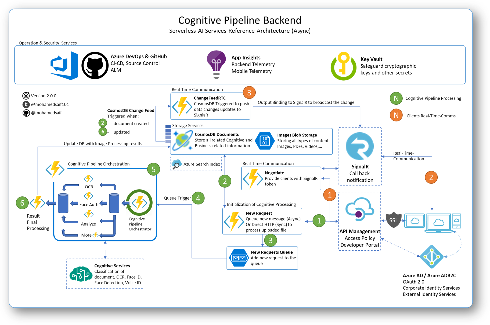
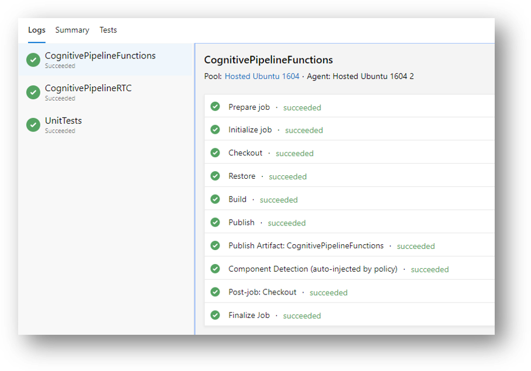
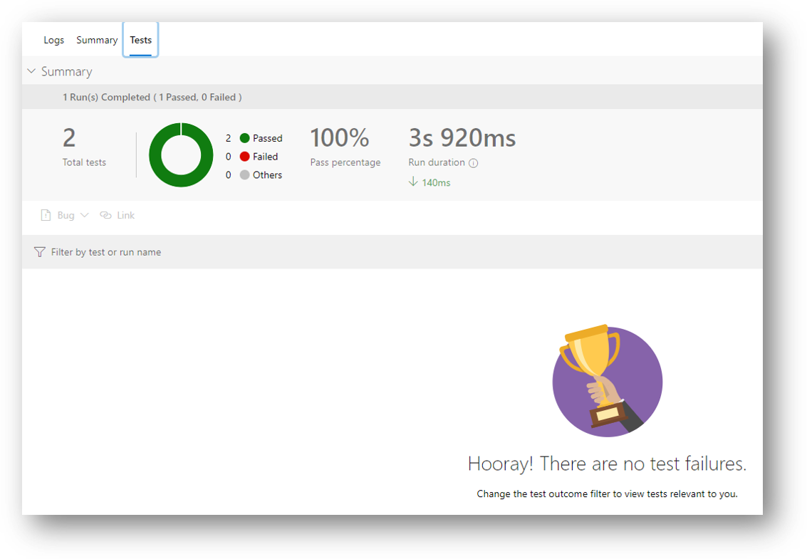
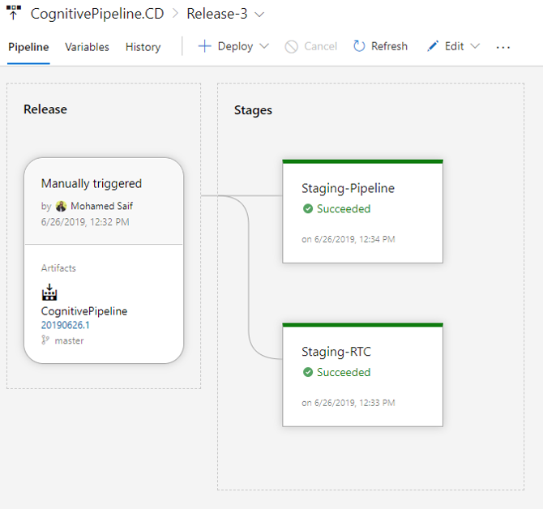

# Cognitive Pipeline

Azure serverless-based architecture to process files through a cognitive pipeline with real-time-communication callback

|Service|Build|Release|
|-|-|-|
|CognitivePipeline.Functions|[](https://gbb-appinnovation.visualstudio.com/CognitivePipeline/_build/latest?definitionId=26&branchName=master)||
|CognitivePipeline.RTC|[](https://gbb-appinnovation.visualstudio.com/CognitivePipeline/_build/latest?definitionId=26&branchName=master)||

## Overview

A customer requested assistance in creating a processing pipeline for uploaded files leveraging mainly [Azure Cognitive Services](https://azure.microsoft.com/en-us/services/cognitive-services/) to attach rich attributes to that file. These data can be then used to search the data and/or plot rich visual interfaces.

Solution requirements:

1. Support multiple file types (images, videos, PDF,...)
2. Support multi-step processing per file (like performing face detection, OCR and object detection on a single image)
3. Operations must be async
4. Support having call back when the async processing of a file is finished
5. Scalable implementation to have low cost when idling and adequate power when needed
6. Expandable architecture to add additional capabilities in the future
7. Ability to easily search of the attributes generated from the cognitive processing pipeline
8. Both build and release must be automated via solid DevOps CI/CD pipelines

## Architecture

The start of the show is [Azure Functions](https://docs.microsoft.com/en-us/azure/azure-functions/) 🤩! with cost efficiency and scalability requirements met without worrying too much about the infrastructure behind the scene.

Later on I will discuss the Azure components in more details, for now let's have a look at the architecture:



Let's discuss the steps for the 2 main scenarios:

### 1. Cognitive Pipeline Processing

Below is the steps highlighted in the architecture diagram showing what is happing when a user submit a new file with instructions for processing.

1. User submit a new Cognitive File request ([CognitiveFile](src/CognitivePipeline/CognitivePipeline.Functions/Models/CognitiveStep.cs) json + file data) to [NewCognitiveReq](src/CognitivePipeline/CognitivePipeline.Functions/Functions/NewCognitiveReq.cs) function (assuming that the client already authenticated with Azure AD and have the appropriate API Management subscription key)
2. ```NewCognitiveReq``` function would validate then upload file to storage and update Cosmos Db with the new cognitive instructions.
3. NewCognitiveReq function will then put a new message in ```newreq``` storage queue for the async file processing.
4. A [durable function](https://docs.microsoft.com/en-us/azure/azure-functions/durable/durable-functions-overview) orchestrator named [CognitivePipelineOrchestrator_QueueStart](src/CognitivePipeline/CognitivePipeline.Functions/Orchestrator/CognitivePipelineOrchestrator.cs#L34-L52) is triggered by the ```newreq``` queue new cognitive file processing request.
5. Using [Fan-Out-Fan-In durable function pattern](https://docs.microsoft.com/en-us/azure/azure-functions/durable/durable-functions-concepts#patterns), the durable function orchestrator will:
   1. Loop through all requested [CognitiveStep](src/CognitivePipeline/CognitivePipeline.Functions/Models/CognitiveStep.cs)s to a create a new thread to run that particular instruction.
   2. Each cognitive activity will finish execution in parallel and report back to the orchestrator with the results.
   3. The function orchestrator will wait for all steps to finish via ```Task.WaitAll(parallelTasks);```
6. Finally the orchestrator will send the final result to [CognitivePipeline_Callback](src/CognitivePipeline/CognitivePipeline.Functions/Orchestrator/CognitivePipelineOrchestrator.cs#L183-L194) to commit the updates to the Cosmos Db

### 2. Clients Real-Time-Communication

Leveraging the powerful [Cosmos Db Change Feed with Azure Function](https://docs.microsoft.com/en-us/azure/azure-signalr/signalr-concept-azure-functions) and [SignalR](https://docs.microsoft.com/en-us/azure/azure-signalr/signalr-overview) to add real-time-communication functionality to the registered clients.

Below are the steps highlighted in the architecture diagram:

1. As SignalR in [Serverless mode](https://docs.microsoft.com/en-us/azure/azure-signalr/signalr-concept-serverless-development-config), we need to avail a [Negotiate](src/CognitivePipeline/CognitivePipeline.RTC/RTC/SignalRNegotiator.cs) endpoint which will provide the client with SignalR access token. I used Http triggered Azure Function to accomplish that beautifully.
2. Client would then establish a connection to SignalR service (via calling the negotiate endpoint). A client application requires a valid access token to connect to Azure SignalR Service obtained from the negotiate endpoint.
3. Finally with a Change Feed lease connected to an Azure Function named [CognitiveFilesDbFeedProcessor](src/CognitivePipeline/CognitivePipeline.RTC/Functions/CognitiveFilesDbFeedProcessor.cs), it will listen to the updates and push it to the SignalR Hub. SignalR will then push the update to all connected clients to the Hub.

I've included in the repo a simple JS client that leverages SignalR JS SDK library that would look something like:


## Azure Components

You will need to provision the following services:

- 2 Azure Function Apps (one for processing pipeline and one for RTC callback)
- 1 Storage Account
- 1 Cosmos Db
- 1 API Management (OPTIONAL)
- 1 SignalR Service
- 1 Cognitive Service 
- 1 Face Cognitive Service (OPTIONAL)
- 1 Azure Search Index (OPTIONAL)
- 1 Azure AD (Or Azure AD B2C) tenant (OPTIONAL)
- 1 Azure KeyVault (OPTIONAL) - [GlobalSettings.cs]() is designed to allow fetching the settings from either the environment or Azure Key Vault.

You need the following local.settings.json to run locally or set them up in Environment Variables in the Function App configuration.

### CognitivePipeline.Functions

```js
{
  "IsEncrypted": false,
  "Values": {
    "AzureWebJobsStorage": "UseDevelopmentStorage=true",
    "FUNCTIONS_WORKER_RUNTIME": "dotnet",
    "Env": "Development",
    "cosmosDbEndpoint": "YOURDBENDPOINT",
    "cosmosDbKey": "YOUDBKEY",
    "cognitivePipelineStorageConnection": "STORAGECONNECTION",
    "computerVisionKey": "YOURKEY",
    "computerVisionEndpoint": "YOURENDPOINT",
    "faceKey": "YOURKEY",
    "faceEndpoint": "YOUENDPOINT"
  }
}
```

### CognitivePipeline.RTC

```js
{
  "IsEncrypted": false,
  "Values": {
    "AzureWebJobsStorage": "UseDevelopmentStorage=true",
    "FUNCTIONS_WORKER_RUNTIME": "dotnet",
    "SignalRConnectionString": "YOURSIGNALRCONNECTION",
    "CogntiveFilesDbConnectionString": "COSMOSDBCONNECTIONSTRING"
  },
  "Host": {
    "LocalHttpPort": 7071,
    "CORS": "http://localhost:8080",
    "CORSCredentials": true
  }
}
```

## Automated CI/CD Pipelines

Using [Azure DevOps pipelines](https://github.com/marketplace/azure-pipelines) integration with GitHub, I have fully automated build and release pipelines.



You can check the pipelines definition to build and unit test the solutions here: [azure-pipelines.yml](azure-pipelines.yml)



Also this is a view of how I'm releasing to my Function App:



## Roadmap

Currently I'm working to:
1.  Completing both API Management and Azure Active Directory integration 👌
2.  Adjust SignalR usage to allow different users to listening to only the events published under their account 🤷‍
3.  Introduce new cognitive steps capabilities (especially the [Azure Video Indexer](https://docs.microsoft.com/en-us/azure/media-services/video-indexer/) service)
4.  Add Azure Search
3.  Generate rich Xamarin Mobile Client that can upload images and connect to SignalR for getting real-time-update about the processing status 🐱‍💻
4.  Any other cool ideas that might arise 😎

## About the project

I tried to make sure I cover all aspects and best practices while building this project, but all included architecture, code, documentation and any other artifact represent my personal opinion only. Think of it as a suggestion of how a one way things can work.

Keep in mind that this is a work-in-progress, I will continue to contribute to it when I can.

All constructive feedback is welcomed 🙏

## Support

You can always create issue, suggest an update through PR or direct message me on [Twitter](https://twitter.com/mohamedsaif101).

## Authors

|                  |
|:----------------------------------------------:|
|                 **Mohamed Saif**               |
|     [GitHub](https://github.com/mohamedsaif)   |
|  [Twitter](https://twitter.com/mohamedsaif101) |
|         [Blog](http://blog.mohamedsaif.com)    |